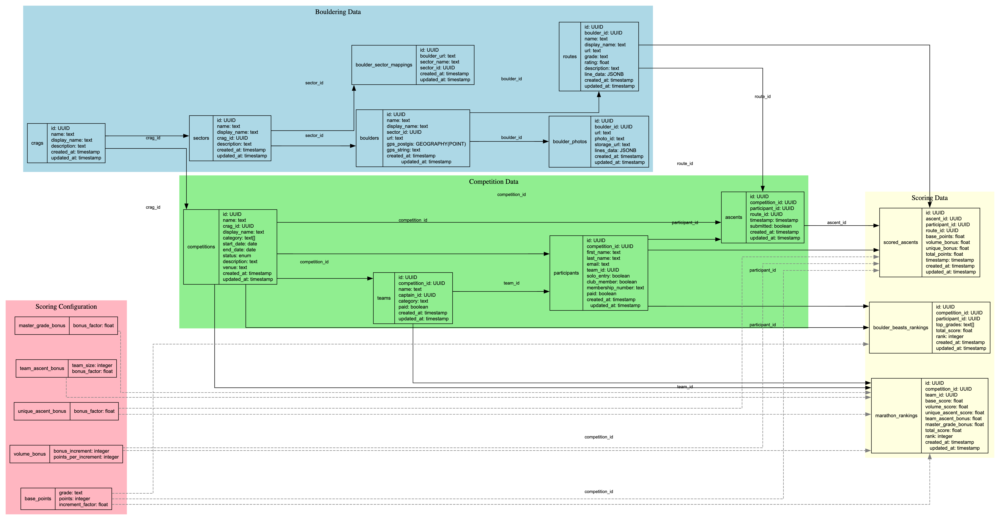

# Boulder Competition API

API service for the Bouldering Festival Competition app, providing score calculation and 27crags data scraping capabilities.

## Features

- **Score Calculation**: Calculate competition scores based on team ascents.
- **Leaderboard Generation**: Create and update real-time leaderboards.
- **27crags Scraping**: Scrape boulder data from 27crags to update competition data.
- **Background Task Processing**: Using Celery for asynchronous task execution.
- **Supabase Integration**: Connect to the main app's Supabase database.

## Tech Stack

- **FastAPI**: Modern, high-performance web framework for building APIs
- **Celery**: Asynchronous task queue for background processing
- **Redis**: Message broker for Celery
- **Supabase**: Database integration with the main app
- **Python 3.12+**: Core programming language
- **Docker**: Container platform for consistent development and deployment

## Project Structure

```file
boulder-comp-api/
├── api/                  # FastAPI endpoints and route handlers
├── scraper/              # 27crags scraping logic
├── scoring/              # Score calculation logic
├── tasks/                # Celery background tasks
├── utils/                # Common utilities and helpers
├── tests/                # Unit and integration tests
├── supabase/             # Supabase configuration and migrations
├── docs/                 # Documentation and diagrams
├── main.py               # FastAPI app entry point
├── .env                  # Environment variables (not committed)
├── docker-compose.yml    # Docker Compose configuration
├── Dockerfile            # Docker configuration for FastAPI app
├── Dockerfile.celery     # Docker configuration for Celery worker
├── requirements.txt      # Python dependencies
├── heroku.yml            # Heroku container deployment configuration
├── Procfile              # Heroku process definitions
├── app.json              # Heroku app configuration
└── .dockerignore         # Files to exclude from Docker builds
```

## Environment Variables

Create a `.env` file in the root directory with the following variables:

```env
# Supabase Configuration
SUPABASE_URL=https://your-project.supabase.co
SUPABASE_ANON_KEY=your-api-key
SUPABASE_SERVICE_ROLE_KEY=your-service-api-key

# Redis Configuration (for Celery)
REDIS_URL=redis://localhost:6379/0

# Development Environment
DEBUG=True
ENVIRONMENT=development

# API Configuration
API_PREFIX=/api
API_HOST=0.0.0.0
API_PORT=8000
```

For Heroku deployment, these variables should be set using the Heroku CLI or dashboard.

## Setup and Installation

### Option 1: Using Docker (Recommended)

1. Clone the repository:

   ```bash
   git clone https://github.com/yourusername/boulder-comp-api.git
   cd boulder-comp-api
   ```

2. Create the `.env` file as described in the Environment Variables section above

3. Build and start the Docker containers:

   ```bash
   docker compose up -d
   ```

   This will start:
   - FastAPI application (accessible at <http://localhost:8000>)
   - Celery worker for background tasks
   - Redis for message brokering

4. Access the API documentation:
   - Open `http://localhost:8000/docs` in your browser

### Option 2: Local Development

1. Clone the repository:

   ```bash
   git clone https://github.com/yourusername/boulder-comp-api.git
   cd boulder-comp-api
   ```

2. Set up a virtual environment:

   ```bash
   python -m venv .venv
   source .venv/bin/activate  # On Windows: .venv\Scripts\activate
   ```

3. Install dependencies:

   ```bash
   pip install -r requirements.txt
   ```

4. Create the `.env` file as described in the Environment Variables section above

5. Start Redis (required for Celery):

   ```bash
   # Using Docker
   docker run -d -p 6379:6379 redis
   # Or install Redis locally
   ```

6. Start the FastAPI server:

   ```bash
   uvicorn main:app --reload
   ```

7. Start the Celery worker:

   ```bash
   celery -A tasks worker --loglevel=info
   ```

## Docker Commands

- Start all services:

  ```bash
  docker-compose up -d
  ```

- View logs:

  ```bash
  docker-compose logs -f
  ```

- Rebuild services after making changes:

  ```bash
  docker-compose up -d --build
  ```

- Stop all services:

  ```bash
  docker-compose down
  ```

- Access a container's shell:

  ```bash
  docker-compose exec api bash
  docker-compose exec celery-worker bash
  ```

- View running containers:

  ```bash
  docker-compose ps
  ```

- Check container resource usage:

  ```bash
  docker stats
  ```

## Docker Development Tips

### Essential Docker Commands
```bash
# Start all services (use --build after changing dependencies)
docker compose up -d --build

# View logs for all services or specific ones
docker compose logs -f
docker compose logs -f api          # FastAPI logs
docker compose logs -f celery-worker # Celery logs

# Stop all services
docker compose down

# Access container shell
docker compose exec api bash
docker compose exec celery-worker bash
```

### Understanding the `--build` Flag

The `--build` flag is critical to understand:

```bash
# Without --build: Uses cached images, might miss dependency updates
docker compose up -d

# With --build: Forces rebuild with fresh dependencies
docker compose up -d --build
```

When to use `--build`:
- After modifying `requirements.txt`
- After changing Dockerfile or Dockerfile.celery
- If you encounter module import errors (e.g., "ModuleNotFoundError")
- When switching branches with different dependencies

Common errors without `--build`:
- Missing module errors
- Outdated dependencies
- Changes to Docker configuration not applied

### Troubleshooting Tips

1. **Container Won't Start**:
   - Check logs: `docker compose logs <service_name>`
   - Verify environment variables in `.env`

2. **Redis Connection Issues**:
   ```bash
   # Check Redis is running
   docker compose ps redis
   # Verify connection
   docker compose exec redis redis-cli ping
   ```

3. **Celery Worker Issues**:
   ```bash
   # Check detailed logs
   docker compose logs celery-worker
   # Restart worker
   docker compose restart celery-worker
   ```

4. **Cleanup and Maintenance**:
   ```bash
   # Clean up unused resources
   docker system prune
   
   # Remove all stopped containers, unused networks, dangling images, and build cache
   docker system prune -a
   ```

## Database Design

## 🗄️ Database Schema

### 🧗 Bouldering Data Tables

#### `crags`

| Field         | Type         | Notes                                |
|---------------|--------------|--------------------------------------|
| `id`          | UUID / PK    | Unique crag ID                       |
| `name`        | text         | Unique crag name                     |
| `display_name`| text         | Formatted display name               |
| `description` | text / null  | Optional crag description            |
| `created_at`  | timestamp    | When added                           |
| `updated_at`  | timestamp    | Last updated                         |

#### `sectors`

| Field         | Type         | Notes                                |
|---------------|--------------|--------------------------------------|
| `id`          | UUID / PK    | Unique sector ID                     |
| `name`        | text         | Unique sector name                   |
| `display_name`| text         | Formatted display name               |
| `crag_id`     | FK → crags.id| Reference to parent crag             |
| `description` | text / null  | Optional sector description          |
| `created_at`  | timestamp    | When added                           |
| `updated_at`  | timestamp    | Last updated                         |

#### `boulders`

| Field         | Type           | Notes                                |
|---------------|----------------|--------------------------------------|
| `id`          | UUID / PK      | Unique boulder ID                    |
| `name`        | text           | Boulder name                         |
| `display_name`| text           | Formatted display name               |
| `url`         | text           | 27crags URL                          |
| `sector_id`   | FK → sectors.id| Reference to sector                  |
| `gps_postgis`  | GEOGRAPHY(POINT)| PostGIS formatted coordinates (POINT(lon lat))|
| `gps_string`  | text           | Raw coordinates string (lat, lon)    |
| `created_at`  | timestamp      | When added                           |
| `updated_at`  | timestamp      | Last updated                         |

#### `boulder_photos`

| Field        | Type         | Notes                                      |
|--------------|--------------|--------------------------------------------|
| `id`         | UUID / PK    | Unique photo ID                            |
| `boulder_id` | FK → boulders.id | Linked boulder                        |
| `url`        | text         | Original photo URL                         |
| `photo_id`   | text         | Photo identifier                           |
| `storage_url`| text / null  | URL in Supabase Storage after upload       |
| `lines_data` | JSONB / null | Optional route line data                   |
| `created_at` | timestamp    | When added                                 |
| `updated_at` | timestamp    | Last updated                               |

#### `routes`

| Field        | Type         | Notes                                    |
|--------------|--------------|------------------------------------------|
| `id`         | UUID / PK    | Unique route ID                          |
| `boulder_id` | FK → boulders.id | Linked boulder                      |
| `name`       | text         | Route name                               |
| `display_name`| text        | Formatted display name                   |
| `url`        | text         | Route URL on 27crags                     |
| `grade`      | text         | e.g. '6A+', '7B'                         |
| `rating`     | float / null | Route rating                             |
| `description`| text / null  | Route description                        |
| `line_data`  | JSONB / null | Route line data                          |
| `created_at` | timestamp    | When added                               |
| `updated_at` | timestamp    | Last updated                             |

#### `boulder_sector_mappings`

| Field         | Type           | Notes                               |
|---------------|----------------|-------------------------------------|
| `id`          | UUID / PK      | Unique mapping ID                   |
| `boulder_url` | text           | URL of boulder on 27crags           |
| `sector_name` | text           | Name of the sector                  |
| `sector_id`   | FK → sectors.id| Reference to sector                 |
| `created_at`  | timestamp      | When added                          |
| `updated_at`  | timestamp      | Last updated                        |

---

### 🧑‍🤝‍🧑 Competition Tables

#### `competitions`

| Field         | Type           | Notes                                                       |
|---------------|----------------|-------------------------------------------------------------|
| `id`          | UUID / PK      | Unique competition ID                                       |
| `name`        | text           | Name of the competition (e.g. "May 2025 Club Comp")         |
| `crag_id`     | FK → crags.id  | Crag where the competition takes place                      |
| `display_name`| text           | Formatted display name                                      |
| `category`    | text[]         | Categories hosted (e.g. "marathon,boulder beasts")          |
| `start_date`  | date           | Competition start date                                      |
| `end_date`    | date           | Competition end date                                        |
| `status`      | enum           | "ongoing" or "completed"                                    |
| `description` | text / null    | Details about the competition                               |
| `venue`       | text / null    | Location/venue of the event                                 |
| `created_at`  | timestamp      | When added                                                  |
| `updated_at`  | timestamp      | Last updated                                                |

#### `teams`

| Field           | Type         | Notes                                                |
|-----------------|--------------|------------------------------------------------------|
| `id`            | UUID / PK    | Unique team ID                                       |
| `competition_id`| FK → competitions.id | Competition this team is registered for      |
| `name`          | text         | Team name                                            |
| `captain_id`    | FK → participants.id | Optional (ID of the team captain)           |
| `category`      | text         | Always `'marathon'` for team entries                 |
| `paid`          | boolean      | Whether the team has been marked as paid             |
| `created_at`    | timestamp    | Signup time                                          |

#### `participants`

| Field               | Type         | Notes                                                         |
|---------------------|--------------|---------------------------------------------------------------|
| `id`                | UUID / PK    | Unique participant ID                                         |
| `competition_id`    | FK → competitions.id | Competition this participant is registered for         |
| `first_name`        | text         | First name                                                    |
| `last_name`         | text         | Last name                                                     |
| `email`             | text         | Email address                                                 |
| `team_id`           | FK → teams.id | Nullable if solo participant                                  |
| `solo_entry`        | boolean      | True if entered directly into Boulder Beasts (solo entry)       |
| `club_member`       | boolean      | Whether a current club member                                 |
| `membership_number` | text / null  | For free entry if applicable                                  |
| `paid`              | boolean      | Whether payment is complete (solo or updated by admin)        |
| `created_at`        | timestamp    | Signup time                                                   |

#### `ascents`

| Field           | Type         | Notes                                                |
|-----------------|--------------|------------------------------------------------------|
| `id`            | UUID / PK    | Unique ascent ID                                     |
| `competition_id`| FK → competitions.id | Competition associated with this ascent       |
| `participant_id`| FK → participants.id | Who climbed it                                  |
| `route_id`      | FK → routes.id | Route climbed                                       |
| `timestamp`     | timestamp    | Logged time                                          |
| `submitted`     | boolean      | Whether the log is finalized (final submission)      |

---

### 📊 Scoring Configuration Tables

#### `base_points`

| Field          | Type         | Notes                              |
|----------------|--------------|------------------------------------|
| `grade`        | text         | e.g. '6A', '7B+'                   |
| `points`       | integer      | Point value for this grade         |
| `increment_factor` | float / null | Optional, for extrapolations       |

#### `volume_bonus`

| Field                   | Type    | Notes                             |
|-------------------------|---------|-----------------------------------|
| `bonus_increment`       | integer | Ascents count increment (e.g. every 5)  |
| `points_per_increment`  | integer | Points awarded per increment      |

#### `unique_ascent_bonus`

| Field          | Type   | Notes                                |
|----------------|--------|--------------------------------------|
| `bonus_factor` | float  | Multiplier for unique ascents (e.g. 1.0) |

#### `team_ascent_bonus`

| Field          | Type    | Notes                                 |
|----------------|---------|---------------------------------------|
| `team_size`    | integer | E.g. 2, 3, or 4                        |
| `bonus_factor` | float   | E.g. 0.10 for 10% bonus                  |

#### `master_grade_bonus`

| Field          | Type  | Notes                                |
|----------------|-------|--------------------------------------|
| `bonus_factor` | float | 50% bonus for team with most ascents in a grade category |

---

### 🧮 Scoring Result Tables

#### `scored_ascents`

| Field            | Type         | Notes                                         |
|------------------|--------------|-----------------------------------------------|
| `id`             | UUID / PK    | Unique key (or composite key with ascent_id)  |
| `ascent_id`      | FK → ascents.id | Original ascent reference                  |
| `participant_id` | FK → participants.id | Climber reference                      |
| `route_id`       | FK → routes.id | Route reference                             |
| `base_points`    | float        | Points from `base_points` table               |
| `volume_bonus`   | float        | Bonus from `volume_bonus`                     |
| `unique_bonus`   | float        | Bonus from `unique_ascent_bonus`              |
| `total_points`   | float        | Sum of all points for this ascent             |
| `timestamp`      | timestamp    | Inherited from the original ascent            |

#### `marathon_rankings`

| Field                | Type      | Notes                                            |
|----------------------|-----------|--------------------------------------------------|
| `team_id`            | FK → teams.id | Team reference                               |
| `base_score`         | float     | Sum of base points                               |
| `volume_score`       | float     | Total volume bonus                               |
| `unique_ascent_score`| float     | Sum of unique ascent bonuses                     |
| `team_ascent_bonus`  | float     | Bonus for all team members climbing a route      |
| `master_grade_bonus` | float     | Bonus for leading in a specific grade            |
| `total_score`        | float     | Final aggregated score                           |
| `rank`               | integer   | Final placement                                  |

#### `boulder_beasts_rankings`

| Field              | Type         | Notes                                               |
|--------------------|--------------|-----------------------------------------------------|
| `participant_id`   | FK → participants.id | Participant reference                       |
| `top_grades`       | text[] / JSON | List of top 5 grades (e.g. `["7A", "7B+", ...]`)    |
| `total_score`      | float        | Final score based on individual ascents            |
| `rank`             | integer      | Final placement                                    |

## Entity Relationship Diagram (ERD)



## API Endpoints

### Scraper API

- `POST /api/scraper/scrape` - Start a scraping task for 27crags data
- `GET /api/scraper/task/{task_id}` - Check status of a scraping task

### Scoring API

- `POST /api/scoring/calculate` - Calculate scores for a competition
- `GET /api/scoring/task/{task_id}` - Check status of a calculation task
- `GET /api/scoring/leaderboard/{competition_id}` - Get competition leaderboard

## Development

- Follow PEP8 style guidelines
- Write tests for new features
- Add documentation for API endpoints

## Deployment

This API is designed to be deployed using Docker:

### Heroku

1. Install the Heroku CLI and login:

   ```bash
   brew install heroku
   heroku login
   ```

2. Create a new Heroku app:

   ```bash
   heroku create your-app-name
   ```

3. Add Redis add-on:

   ```bash
   heroku addons:create heroku-redis:hobby-dev -a your-app-name
   ```

4. Set environment variables:

   ```bash
   heroku config:set SUPABASE_URL=your_url
   heroku config:set SUPABASE_ANON-KEY=your_key
   heroku config:set SUPABASE_SERVICE-ROLE-KEY=your_key
   # Add other environment variables
   ```

5. Enable the container stack:

   ```bash
   heroku stack:set container -a your-app-name
   ```

6. Login to Heroku Container Registry:

   ```bash
   heroku container:login
   ```

7. Deploy the app:

   ```bash
   git push heroku main
   ```

8. Scale dynos:

   ```bash
   heroku ps:scale web=1 worker=1
   ```

9. View logs:

   ```bash
   heroku logs --tail
   ```

#### Custom Domain and SSL

1. Add your custom domain to Heroku:

   ```bash
   heroku domains:add www.yourdomain.com -a your-app-name
   ```

2. Verify domain ownership and configure DNS:
   - Add the provided DNS target as a CNAME record for your domain
   - For apex domains, use DNS provider's ALIAS/ANAME record or Heroku's DNS service

3. Enable Automatic Certificate Management (ACM) for SSL:

   ```bash
   heroku certs:auto:enable -a your-app-name
   ```

4. Check certificate status:

   ```bash
   heroku certs:auto -a your-app-name
   ```

#### Troubleshooting

- Restart dynos:

  ```bash
  heroku dyno:restart -a your-app-name
  ```

- Check running dynos:

  ```bash
  heroku ps -a your-app-name
  ```

- View detailed logs:

  ```bash
  heroku logs --tail --source app -a your-app-name
  ```

#### Monitoring and Logging

1. Set up application monitoring with Heroku add-ons:

   ```bash
   # New Relic for application performance monitoring
   heroku addons:create newrelic:wayne -a your-app-name
   
   # Papertrail for log management
   heroku addons:create papertrail:choklad -a your-app-name
   ```

2. Configure custom metrics with Heroku metrics:

   ```bash
   # Enable Heroku metrics
   heroku labs:enable runtime-metrics -a your-app-name
   
   # View metrics
   heroku metrics -a your-app-name
   ```

3. Set up alerts for important events:

   ```bash
   # Using Librato for metric alerts
   heroku addons:create librato:development -a your-app-name
   ```

4. Access application metrics dashboards:

   ```bash
   # Open metrics dashboard
   heroku addons:open librato -a your-app-name
   
   # Open logs dashboard
   heroku addons:open papertrail -a your-app-name
   ```

### Docker and Container Best Practices

- **Environment Variables**: Always use environment variables for configuration (credentials, URLs, etc.) instead of hardcoding values
- **Container Images**: Use specific version tags for base images (e.g., `python:3.12-slim` instead of `python:latest`)
- **Image Cleanup**: Periodically clean up unused images to save disk space:

  ```bash
  docker image prune -a
  ```

- **Health Checks**: Consider adding health checks to your containers to ensure they're running correctly
- **Volumes for Persistent Data**: Use Docker volumes for any data that needs to persist between container restarts
- **Network Security**: Configure container networks to only expose necessary ports
- **Resource Limits**: Set memory and CPU limits for containers in production environments

## License

This project is licensed under the MIT License - see the LICENSE file for details.
