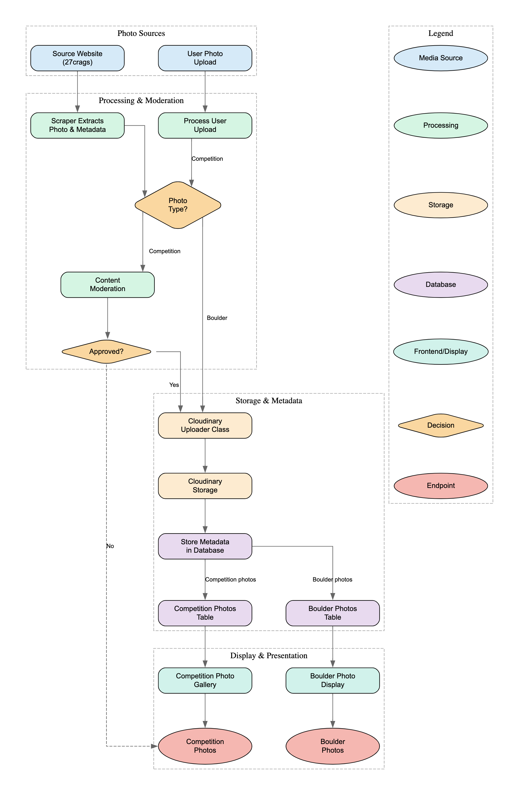

# Media Storage and Photo Management

## Overview

This application uses Cloudinary as its image hosting solution for both boulder photos and competition-submitted images. This document outlines our storage architecture, security model, and optimization strategies.

## Media Storage Flow

The media storage system handles two distinct photo workflows - boulder photos (from scraping) and competition photos (from user uploads). The complete flow is illustrated in the diagram below:



*Note: To regenerate this diagram, use the DOT file located at `docs/media/media_storage_flow.dot` with a GraphViz tool such as [Dreampuf's Online GraphViz Editor](https://dreampuf.github.io/GraphvizOnline/).*

## Storage Structure

All media is organized in Cloudinary using the following folder structure:

```
boulder-comp/
├── boulder-photos/
│   ├── crag-name-1/
│   │   ├── sector-name-1/
│   │   │   ├── crag_name_sector_name_boulder_name_photo_id_hash.jpg
│   │   │   └── ...
│   │   ├── sector-name-2/
│   │   │   └── ...
│   │   └── ...
│   ├── crag-name-2/
│   │   └── ...
│   └── ...
├── competition-photos/
    ├── competition-name-1/
    │   ├── uploader_name_hash.jpg
    │   └── ...
    ├── competition-name-2/
    │   └── ...
    └── ...
```

This structure provides several benefits:
1. **Logical Organization**: Photos are grouped by type, crag/competition, and sector (for boulder photos)
2. **Security**: Access control can be applied at different levels of the hierarchy
3. **Performance**: Easier lookup and management of photos
4. **Traceability**: Photos can be easily associated with their source
5. **Descriptive Naming**: Each photo's filename includes its full context (crag, sector, boulder) for better organization and searchability

## Image Optimization with Cloudinary

Cloudinary provides advanced image optimization capabilities:

1. **Adaptive Format Delivery**:
   - Automatically serves WebP or AVIF to supporting browsers
   - Falls back to JPEG/PNG for older browsers
   - Reduces file sizes by 30-70% compared to traditional formats

2. **Automatic Quality Optimization**:
   - Uses perceptual quality algorithms to reduce file size without visible quality loss
   - Adapts quality settings based on image content

3. **Responsive Delivery**:
   - Generates multiple resolution variants automatically
   - Delivers appropriate size based on device and viewport
   - Reduces data usage on mobile devices

4. **Global CDN Integration**:
   - Faster loading times worldwide
   - Reduced latency in remote areas
   - Critical for competitions in areas with limited connectivity

## Access Control and Security

### Boulder Photos

Boulder photos are accessible to:
1. **All Users**: Public access is granted for boulder photos
2. **API Backend**: Full access for management operations

### Competition Photos

Competition photos use a more restricted access model:

1. **Administrators**: 
   - Full access to view, approve, and feature photos
   - Can moderate inappropriate content

2. **Competition Participants**: 
   - Can submit photos to their assigned competitions
   - Can view approved photos from their competitions

3. **Public Users**:
   - Can only see approved and featured photos

### Technical Implementation

Access control is implemented through:

1. **Database Filtering**:
   - Competition photos are filtered based on approval status and user roles
   - Only approved photos are returned to non-admin users

2. **API Authorization**:
   - Photo approval/featuring endpoints require admin authentication
   - Photo submission endpoints verify participant status

3. **Content Moderation**:
   - Automatic content moderation via Cloudinary's AWS Rekognition integration
   - Admin review interface for flagged content

## Photo Upload Flow

### Boulder Photos

Boulder photos follow this upload process:
1. Images are initially scraped from source websites
2. The API processes and uploads these images to Cloudinary
3. Image metadata is stored in the database, linking to boulder records

### Competition Photos

For user-submitted competition photos:
1. Users upload photos through the frontend application
2. The API receives the temporary photo URL
3. Photos are uploaded to Cloudinary with moderation enabled
4. Database records are created with pending approval status
5. Administrators review and approve photos
6. Approved photos appear in competition galleries

## Technical Implementation

The media storage system is implemented through:

1. **CloudinaryUploader Class**:
   - Handles all upload operations
   - Manages folder organization
   - Applies appropriate transformations and tags

2. **REST API Endpoints**:
   - `/upload-boulder-photos/{crag_name}`: Upload boulder photos for a crag
   - `/upload-competition-photos/{competition_id}`: Upload user submissions
   - `/competition-photos/{competition_id}`: Retrieve competition photos
   - `/competition-photos/{photo_id}/approve`: Approve/reject photos
   - `/competition-photos/{photo_id}/feature`: Feature special photos

3. **Database Integration**:
   - Tables track Cloudinary URLs and public IDs
   - Tracks approval status and moderation information
   - Links photos to their associated entities (boulders/competitions)

4. **Frontend Components**:
   - Photo gallery component for displaying competition photos
   - Upload component with preview and progress indication
   - Administration interface for content moderation and management

## Integration with Scraper

The media storage system integrates tightly with the scraper component to automatically process and store boulder photos:

1. **Automatic Extraction**: The scraper extracts photos and route lines from 27crags
2. **Processing Pipeline**: Photos undergo processing for optimization and metadata extraction
3. **Batch Upload**: Images are uploaded in batches to minimize API calls to Cloudinary
4. **Database Synchronization**: Photo records are created and linked to boulders in the database

## Route Line Visualization

In addition to storing photos, the system handles route line data:

1. **SVG Data Extraction**: Line data is extracted from 27crags SVG overlays
2. **JSON Transformation**: SVG paths are converted to JSON format for easy overlay rendering
3. **Client-Side Rendering**: Frontend uses the line data to overlay climb routes on boulder images
4. **Interactive Features**: Users can toggle route lines, view difficulty, and get additional route information

## Performance Considerations

The system implements several optimizations for performance:

1. **Lazy Loading**: Images are loaded only when needed, using Cloudinary's responsive loading techniques
2. **Advanced Caching**: Images are cached at multiple levels (CDN, browser, application)
3. **Connection Pooling**: Database connections are pooled for efficient photo metadata retrieval
4. **Background Processing**: Photo uploads occur in background tasks to avoid blocking API responses

## Error Handling

Robust error handling ensures reliability:

1. **Upload Retries**: Failed uploads are automatically retried with exponential backoff
2. **Partial Success**: Batch operations continue even if individual items fail
3. **Fallback Mechanisms**: If optimized images fail to load, the system falls back to original images
4. **Monitoring**: All media operations are logged and monitored for errors

## Testing Access Control

You can test the competition photo access control by:

1. Creating test users with different roles (admin, participant)
2. Registering them for different competitions
3. Verifying they can only access photos from their assigned competitions

## Future Improvements

Planned enhancements to the media system:

1. **AI-Powered Tagging**: Automatic tagging of boulder photos based on content
2. **User Comments**: Allow users to comment on competition photos
3. **Offline Support**: Progressive web app features for offline photo viewing
4. **Interactive 3D Models**: Integration with photogrammetry for 3D boulder models 