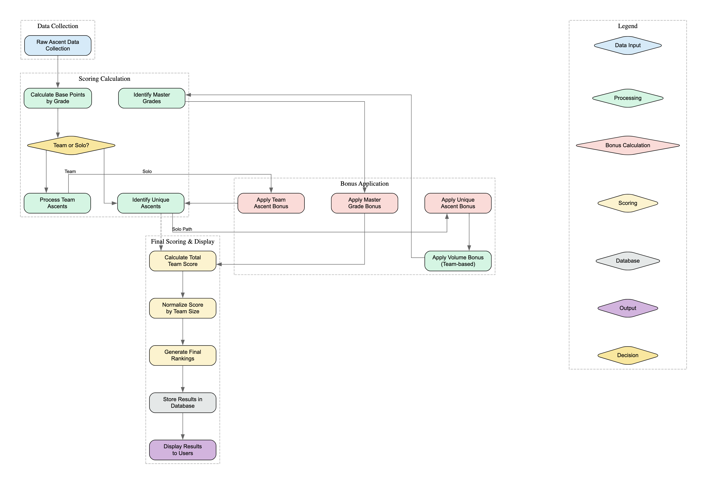

# Scoring System Documentation

## Overview

This document outlines the scoring system for boulder competitions. The system is designed to reward both individual achievement and team collaboration, with a particular focus on the more complex Marathon category. Our scoring algorithm takes into account route difficulty, team dynamics, unique ascents, and volume of climbs.

## Scoring Flow

The scoring process follows a systematic flow from raw ascent data to final rankings, as illustrated in the diagram below:



*Note: To regenerate this diagram, use the DOT file located at `docs/scoring/scoring_flow.dot` with a GraphViz tool such as [Dreampuf's Online GraphViz Editor](https://dreampuf.github.io/GraphvizOnline/).*

## Scoring Categories

The competition offers two main categories:
- **Marathon (Team-Based)**: Teams compete together with complex scoring mechanics that reward collaboration
- **Boulder Beasts (Individual)**: Solo climbers compete based on their individual performance

## Marathon Category Scoring

The Marathon category uses a sophisticated scoring system that balances individual performance with team dynamics:

### Core Mechanics

1. **Base Points**: Ascents are awarded base points based on the grade of the route ascended. Base points are set on the scored_ascents table.

2. **Volume Bonus**: Awarded on a TEAM basis. 25 points are awarded every 5 ascents. i.e. 10 ascents award 50 points to the team, while 9 ascents award only 25 volume bonus points. This does not apply on the scored ascents table as it is determined on an overall team basis, so it is only on the final rankings table.

3. **Team Ascent Bonus**: Awarded only on ascents that all team members have completed and a different bonus factor is applied depending on team size. i.e. if in a team of 3, all three participants complete the same route, then a bonus factor of 18% is added to each of those ascents that qualify. These should apply to the scored ascents table for each ascent.

4. **Unique Ascent Bonus**: Added to an ascent when that ascent is on a route that only one person has climbed across the whole marathon category (unique). An ascent from a solo participant (who automatically only participates in the boulder beasts category, does not get included in the assessment of uniqueness.)

5. **Master Grade Bonus**: Applied to the team that climbed the most routes at a given grade. This is done on a team-basis, therefore it is not on the scored ascents table, but on the final rankings table.

6. **Score Normalization**: All team scores are divided by the team size for normalization and fairness. Final ranking tables must be shown with normalized scores, including bonuses, so that they can be compared like for like. We could have a more detailed staging table with all gross score components and bonuses before normalization for granular data inspection.

### Scoring Formula

The total score for a team in the Marathon category is calculated as follows:

```
Total Score = (Base Points + Volume Bonus + Team Ascent Bonus + Unique Ascent Bonus + Master Grade Bonus) / Team Size
```

Where:
- Base Points = Sum of points for all ascents based on route grade
- Volume Bonus = (Floor(Total Ascents / 5)) * 25
- Team Ascent Bonus = Sum(Base Points for routes climbed by all team members * Bonus Factor)
- Unique Ascent Bonus = Sum(Base Points for unique routes * Unique Bonus Factor)
- Master Grade Bonus = Points awarded to team with most ascents at each grade

## Boulder Beasts Category Scoring

The Boulder Beasts category uses a simpler scoring system focused on individual performance:

1. **Base Points**: Each ascent is awarded points based on the route grade
2. **Top 5 Routes**: Only the climber's 5 highest-scoring routes count toward their final score
3. **Ranking**: Climbers are ranked by their total score from their top 5 routes

## Technical Implementation

The scoring system is implemented through:

1. **Scoring Configuration Tables**:
   - `base_points`: Defines points per grade
   - `volume_bonus`: Configures volume bonus thresholds and points
   - `team_ascent_bonus`: Defines bonus factors per team size
   - `unique_ascent_bonus`: Sets the unique ascent bonus factor
   - `master_grade_bonus`: Configures the master grade bonus factor

2. **Results Tables**:
   - `marathon_rankings`: Stores final team rankings with scores
   - `marathon_detailed_results`: Provides detailed breakdown of score components
   - `boulder_beasts_rankings`: Stores individual climber rankings and scores

3. **Scoring Calculation Process**:
   - Raw ascent data is collected during the competition
   - Scoring rules are applied through SQL queries and application logic
   - Results are calculated in real-time as new ascents are recorded
   - Final rankings are generated and displayed to participants

## Example Calculation

Consider a team of 3 climbers in the Marathon category:

1. The team completes 12 ascents total:
   - 7 routes of grade 6A (100 points each) = 700 base points
   - 3 routes of grade 6B (150 points each) = 450 base points
   - 2 routes of grade 6C (200 points each) = 400 base points
   - Base Points Total = 1550 points

2. Volume Bonus:
   - 12 ascents = Floor(12/5) * 25 = 2 * 25 = 50 points

3. Team Ascent Bonus:
   - The team (all 3 members) completed 2 routes of 6A (100 points each)
   - Team Ascent Bonus Factor for 3-person team = 18%
   - Bonus = 2 * 100 * 0.18 = 36 points

4. Unique Ascent Bonus:
   - 1 route of 6C is unique to this team in the competition
   - Unique Bonus Factor = 20%
   - Bonus = 200 * 0.20 = 40 points

5. Master Grade Bonus:
   - Team has most ascents at grade 6A in the competition
   - Master Grade Bonus = 30 points

6. Total Score:
   - Gross Score = 1550 + 50 + 36 + 40 + 30 = 1706 points
   - Normalized Score = 1706 / 3 = 568.67 points

The team's final normalized score of 568.67 points would be used for ranking against other teams. 